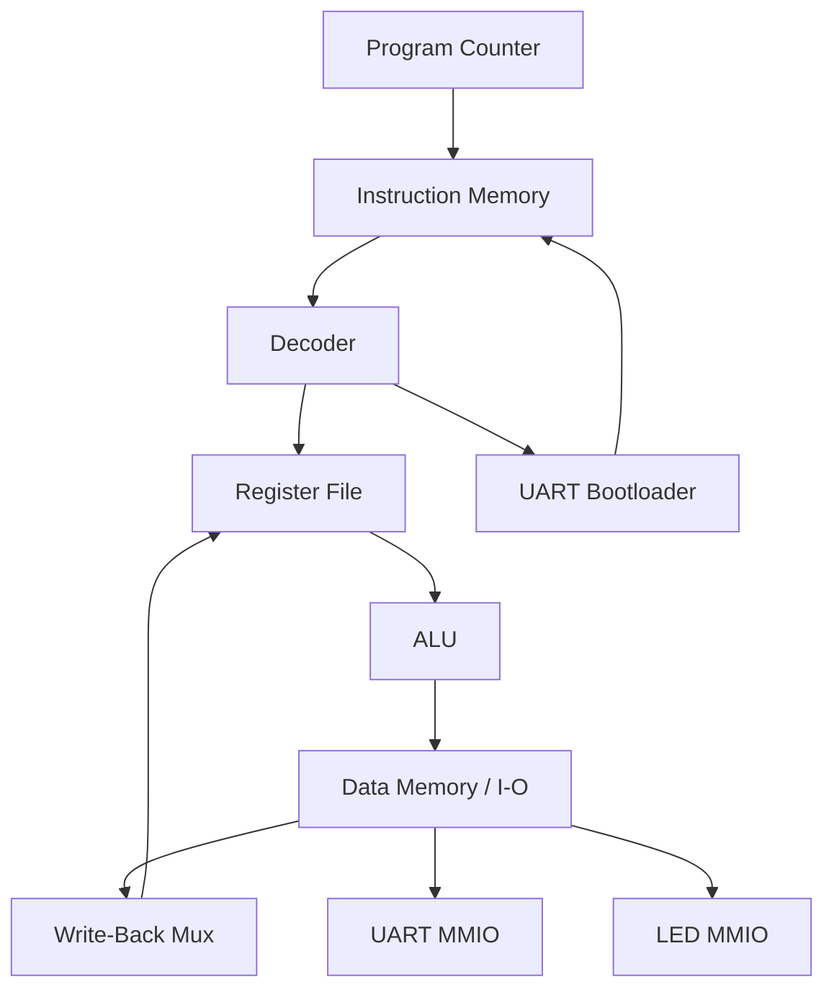

# RISC-V 32-bit CPU Core - Architecture Specification

## Executive Summary

This document describes the complete architecture of a **32-bit RISC-V processor** (RV32I ISA) implemented on Xilinx Artix-7 FPGAs. The core is a **single-cycle, non-pipelined** design optimized for embedded applications. The UART bootloader path is present, but firmware programming via UART is still under debug.

---

## 1. ISA & Instruction Set

### 1.1 Instruction Set Architecture (ISA)
- **Standard**: RISC-V RV32I (32-bit base integer ISA)
- **Word Width**: 32 bits
- **Instruction Format**: 4 bytes (fixed-length encoding)
- **Endianness**: Little-endian

### 1.2 Supported Instructions
| Category | Instructions | Count |
|----------|--------------|-------|
| **Arithmetic** | ADD, SUB, ADDI | 3 |
| **Logical** | AND, OR, XOR, ANDI, ORI, XORI | 6 |
| **Shift** | SLL, SRL, SRA, SLLI, SRLI, SRAI | 6 |
| **Comparison** | SLT, SLTU, SLTI, SLTIU | 4 |
| **Load** | LW, LH, LB, LHU, LBU | 5 |
| **Store** | SW, SH, SB | 3 |
| **Branch** | BEQ, BNE, BLT, BGE, BLTU, BGEU | 6 |
| **Jump** | JAL, JALR | 2 |
| **Upper Immediate** | LUI, AUIPC | 2 |
| **Misc** | NOP (pseudo) | 1 |
| **TOTAL** | | **38 instructions** |

### 1.3 Instruction Formats
```
I-type:  opcode[6:0] | rd[11:7] | funct3[14:12] | rs1[19:15] | imm[31:20]
S-type:  opcode[6:0] | imm[11:7] | funct3[14:12] | rs1[19:15] | rs2[24:20] | imm[31:25]
B-type:  opcode[6:0] | imm[11:7] | funct3[14:12] | rs1[19:15] | rs2[24:20] | imm[31:25]
U-type:  opcode[6:0] | rd[11:7] | imm[31:12]
J-type:  opcode[6:0] | rd[11:7] | imm[31:20]
R-type:  opcode[6:0] | rd[11:7] | funct3[14:12] | rs1[19:15] | rs2[24:20] | funct7[31:25]
```

---

## 2. Pipeline Architecture

### 2.1 Execution Model
- **Pipeline Stages**: 1 (single-cycle, combinational execution)
- **Latency**: 1-3 cycles (depends on instruction type)
- **Throughput**: 1 instruction per cycle (best case)
- **Branch Prediction**: None (default pc+4 fall-through, branch taken in next cycle)

### 2.2 Execution Timeline
```
Cycle N:    Fetch instruction @ PC
            Decode instruction
            Read register file
            Execute ALU
            Access memory
            Write-back result
            Update PC

Cycle N+1:  Fetch instruction @ PC+4 (or branch target)
```

---

## 3. Register Architecture

### 3.1 General Purpose Registers (GPR)
| Register | ABI Name | Purpose | Hardware Notes |
|----------|----------|---------|-----------------|
| x0 | zero | Always 0 | Read-only, cannot write |
| x1 | ra | Return address | Software convention |
| x2 | sp | Stack pointer | Software convention |
| x3-x31 | (various) | General purpose | Read/write |

**Total**: 32 × 32-bit registers

### 3.2 Special Registers
| Register | Name | Width | Function |
|----------|------|-------|----------|
| PC | Program Counter | 32-bit | Current instruction address |
| NPC | Next PC | 32-bit | Next instruction address (combinational) |

### 3.3 Control & Status Registers (CSR)
- **Not implemented** in this core (RV32I base only)
- Future expansion point for interrupts/exceptions

---

## 4. Core Components

### 4.1 Program Counter (PC)
- **Width**: 32 bits
- **Reset Value**: 0x00000000
- **Update Logic**:
  - Sequential: `pc_next = pc + 4` (default)
  - Branch: `pc_next = pc + sign_extend(imm[11:0])` (if condition met)
  - JAL: `pc_next = pc + sign_extend(imm[20:0])`
  - JALR: `pc_next = (rs1 + sign_extend(imm[11:0])) & ~1` (clear LSB)

### 4.2 Instruction Memory (IMEM)
- **Type**: Synchronous dual-port RAM (one read port, one write port)
- **Capacity**: 1024 words (4 KB)
- **Address Width**: 10 bits (word-addressed)
- **Data Width**: 32 bits
- **Initialization**: Pre-loaded with firmware via bootrom.hex; UART bootloader path is still being validated
- **Access**: Combinational read (address input = instruction output same cycle)

**Memory Map**:
```
0x00000000 - 0x00000FFC  (0 KB - 4 KB)    : Instruction Memory
```

### 4.3 Register File
- **Type**: Asynchronous (combinational reads), synchronous writes
- **Ports**: 2 read, 1 write
- **Width**: 32 × 32 bits
- **Read Latency**: 0 cycles (combinational)
- **Write Latency**: 1 cycle (clocked)
- **Special**: x0 is always 0, and writes to x0 are ignored

**Register Operations**:
```
Read:  rs1_data = regfile[rs1_index]  (combinational)
       rs2_data = regfile[rs2_index]  (combinational)

Write: regfile[rd_index] = wb_data    (on clk posedge, if reg_write=1)
```

### 4.4 ALU (Arithmetic Logic Unit)
- **Operations**: 11 types (ADD, SUB, AND, OR, XOR, SLL, SRL, SRA, SLT, SLTU, COPY)
- **Operand Width**: 32 bits each (2 inputs)
- **Result Width**: 32 bits (+ zero flag)
- **Latency**: Combinational
- **Opcodes**:

| ALU Op | funct3 | funct7 | Operation | Example |
|--------|--------|--------|-----------|---------|
| 0000 | 0 | 0 | ADD | add x1, x2, x3 |
| 0001 | 0 | 32 | SUB | sub x1, x2, x3 |
| 0010 | 7 | 0 | AND | and x1, x2, x3 |
| 0011 | 6 | 0 | OR | or x1, x2, x3 |
| 0100 | 4 | 0 | XOR | xor x1, x2, x3 |
| 0101 | 1 | 0 | SLL | sll x1, x2, x3 |
| 0110 | 5 | 0 | SRL | srl x1, x2, x3 |
| 0111 | 5 | 32 | SRA | sra x1, x2, x3 |
| 1000 | 2 | 0 | SLT | slt x1, x2, x3 |
| 1001 | 3 | 0 | SLTU | sltu x1, x2, x3 |
| 1010 | x | x | COPY | (immediate passthrough) |

### 4.5 Branch Comparator
- **Function**: Evaluates branch conditions in parallel with ALU
- **Inputs**: rs1_data, rs2_data, funct3
- **Output**: take_branch (1-bit)
- **Conditions**:

| Condition | funct3 | Logic |
|-----------|--------|-------|
| BEQ | 000 | rs1 == rs2 |
| BNE | 001 | rs1 != rs2 |
| BLT | 100 | rs1 < rs2 (signed) |
| BGE | 101 | rs1 >= rs2 (signed) |
| BLTU | 110 | rs1 < rs2 (unsigned) |
| BGEU | 111 | rs1 >= rs2 (unsigned) |

### 4.6 Decoder
- **Function**: Decodes 32-bit instruction into control signals
- **Inputs**: instruction[31:0], funct3, funct7, opcode
- **Outputs**:
  - alu_op[3:0] - ALU operation select
  - alu_src_imm - ALU operand B from immediate (1) or RS2 (0)
  - mem_read, mem_write - Data memory access control
  - reg_write - Register file write enable
  - is_branch, is_jal, is_jalr - Jump/branch indicators
  - imm_sel[2:0] - Immediate format selector
  - wb_sel[1:0] - Write-back data source

### 4.7 Immediate Generator
- **Function**: Extracts and sign-extends immediate values from instruction
- **Format Support**: I, S, B, U, J types
- **Output Width**: 32 bits (sign-extended)
- **Latency**: Combinational

**Immediate Encoding**:
```
I-type:  sign_extend(instr[31:20])                    [11:0]
S-type:  sign_extend({instr[31:25], instr[11:7]})     [11:0]
B-type:  sign_extend({instr[31], instr[7], instr[30:25], instr[11:8]}, 1) [12:1]
U-type:  {instr[31:12], 12'b0}                        [31:12]
J-type:  sign_extend({instr[31], instr[19:12], instr[20], instr[30:21]}, 1) [20:1]
```

### 4.8 Data Memory (DMEM)
- **Type**: Synchronous single-port RAM
- **Capacity**: 256 words (1 KB)
- **Address Width**: 10 bits (word-addressed, but supports byte access)
- **Data Width**: 32 bits
- **Access Types**: Word (32-bit), Halfword (16-bit), Byte (8-bit)
- **Supported Operations**: Load (LW, LH, LB, LHU, LBU), Store (SW, SH, SB)
- **Sign Extension**: Automatic for LB, LH (sign-extend to 32-bit)
- **Zero Extension**: Automatic for LBU, LHU (zero-extend to 32-bit)

**Memory Map**:
```
0x00000000 - 0x000003FF  (0 KB - 1 KB)     : Data Memory (RAM)
0x80000000              : UART RX/TX MMIO
0x80001000              : LED Output (MMIO)
0x90000000              : Flash (optional)
```

---

## 5. Memory Hierarchy

### 5.1 Overall Memory Map
```
┌─────────────────────────────┬──────────────┬──────────┐
│ Address Range               │ Segment      │ Size     │
├─────────────────────────────┼──────────────┼──────────┤
│ 0x00000000 - 0x000003FF     │ Instr Mem    │ 4 KB     │
│ 0x00000000 - 0x000003FF     │ Data Mem     │ 1 KB     │
│ 0x80000000                  │ UART         │ 4 B      │
│ 0x80001000                  │ LED Output   │ 4 B      │
│ 0x90000000 - 0x900003FF     │ Flash Mem    │ 1 KB     │
└─────────────────────────────┴──────────────┴──────────┘
```

### 5.2 Address Decoder
- **Input**: 32-bit memory address from ALU result
- **Output**: Selection signals for IMEM, DMEM, UART, LED, Flash
- **Decoding Logic**:
  - bits[31:30] = 00 → Data/Instruction RAM
  - bits[31:30] = 10 → UART (0x80000000) or LED (0x80001000)
  - bits[31:30] = 11 → Flash Memory

---

## 6. I/O Subsystem

### 6.1 UART Controller (FT2232HL USB Bridge)
- **Device**: FT2232HL Dual USB-to-UART Bridge on Mimas A7 board
- **Standard**: RS-232, 8N1 (8 data, no parity, 1 stop bit)
- **Baud Rate**: 115200 bps (fixed)
- **Connection**: GPIO J21 (RX), K22 (TX) → USB via FT2232HL
- **Clock**: 100 MHz (generates 115200 baud internally)
- **Address**: 0x80000000 (read/write)
- **Data Format**: 8 bits per character

**Note**: The FT2232HL is integrated on the Mimas A7 board. No external UART adapter needed.
Simply connect USB cable from PC to board for serial activity and bootloader testing; reliable firmware upload is still under debug.

**UART RX (Receive)**:
- Input: uart_rx (GPIO pin)
- Output: 8-bit data (rxd[7:0])
- Status: rx_valid (character received)
- Registers: UART_STATUS, UART_RXDATA

**UART TX (Transmit)**:
- Input: 8-bit data (txd[7:0]), write_en
- Output: uart_tx (GPIO pin)
- Status: tx_busy (transmitter active)
- Registers: UART_TXDATA

### 6.2 LED Output
- **Base Address**: 0x80001000
- **Data Width**: 8 bits (maps to LED[7:0] on FPGA)
- **Operation**: Write 8-bit value, LEDs update combinationally
- **Example**:
  ```
  li x15, 0x80001         # Load upper 0x80001 into x15
  addi x14, x0, 0xFF      # Load 0xFF into x14
  sw x14, 0(x15)          # Write 0xFF to 0x80001000 → LEDs all ON
  ```

### 6.3 UART Bootloader (Under Validation)
- **Status**: 🚧 **UNDER DEBUG** - UART activity is detected, but the upload flow is not yet reliable enough to call complete
- **Enable**: `WITH_UART_BOOT = 1'b1` in `rv32i_led_top.v`
- **Function**: UART-based firmware upload path under validation
- **Protocol**: Raw 32-bit streaming (LSB first, 115200 baud)
- **Timeout**: 
  - Per-word: 50 ms idle (no UART bytes)
  - Absolute: 100M cycles (~1 second at 100 MHz)
- **Target**: Writes to instruction memory (IMEM) starting at 0x00000000
- **Boot Sequence**:
  1. FPGA powers on → system reset asserts
  2. Boot controller waits for UART data (1 second timeout)
  3. If data received → store in IMEM, extend timeout, LED5 lights
  4. Current behavior indicates UART activity, but the programming handoff is still under debug
  5. Once stabilized, CPU will execute firmware from IMEM

**Bootloader Protocol**:
```
Host (Computer):                FPGA (Boot Controller):
                                Wait for UART byte
Send byte 0 ──────────────────→ RX byte, store in word[0]
Send byte 1 ──────────────────→ RX byte, store in word[1]
Send byte 2 ──────────────────→ RX byte, store in word[2]
Send byte 3 ──────────────────→ RX byte, store in word[3]
                                Assemble 32-bit word, write to IMEM[addr]
                                addr++
[50 ms silence] ───────────────→ Timeout detected
                                Release CPU reset, execute firmware
```

---

## 7. Execution Pipeline Flow

### 7.1 Single-Cycle Execution
Each instruction completes in **exactly 1 cycle** (for ALU ops) or **2-3 cycles** (for memory):

```
Cycle 1:  Fetch instr @ PC
          Decode → ALU operands
          Execute ALU
          Branch condition check
          Memory read (if needed)
          Write-back

Cycle 2:  PC updates to pc+4 or branch target
          Fetch next instr
```

### 7.2 Critical Path
```
PC_MUX → IMEM → Decoder → Operand MUX → ALU → DMEM → WB_MUX → RegFile WR
```
**Total delay**: < 10 ns (allows 100 MHz operation on Artix-7)

### 7.3 Instruction Latency by Type
| Instruction Type | Latency | Notes |
|------------------|---------|-------|
| ADD/SUB/Logical | 1 cycle | Result available next cycle |
| Shift | 1 cycle | Combinational |
| Load/Store | 3 cycles | IMEM → Decode → ALU → DMEM write |
| Branch | 2 cycles | Condition evaluated, PC updates next cycle |
| JAL | 2 cycles | PC update next cycle |
| JALR | 3 cycles | ALU result computed, PC update next cycle |

---

## 8. Control Flow

### 8.1 Branch Resolution
1. **Fetch**: Instruction @ PC
2. **Decode**: Identify branch/jump type (is_branch, is_jal, is_jalr)
3. **Execute**: 
   - Evaluate branch condition (in parallel with ALU)
   - Compute target address
4. **Update PC**: 
   - If taken: next_pc = branch_target
   - If not taken: next_pc = pc + 4
5. **Fetch Next**: Instruction @ next_pc (next cycle)

### 8.2 Jump Target Calculation
```
Branch (BEQ, BNE, BLT, BGE, etc):
    if (condition_met):
        next_pc = pc + sign_extend(imm[12:1], 1)
    else:
        next_pc = pc + 4

JAL (Jump-And-Link):
    rd = pc + 4           (return address saved in rd)
    next_pc = pc + sign_extend(imm[20:1], 1)

JALR (Jump-And-Link Register):
    rd = pc + 4           (return address saved in rd)
    next_pc = (rs1 + sign_extend(imm[12:1])) & ~1  (LSB cleared)
```

---

## 9. Performance Characteristics

### 9.1 Clock Speed
- **Frequency**: 100 MHz (configurable)
- **Clock Period**: 10 ns
- **Critical Path**: ~9 ns (ALU → DMEM)

### 9.2 Throughput
- **Peak IPC**: 1.0 (1 instruction per cycle)
- **Average IPC**: ~0.9-0.95 (accounting for branch mispredicts)
- **Instructions per Cycle (typical)**: 0.9-1.0

### 9.3 Power Consumption (Estimated)
- **Core Logic**: ~50 mW @ 100 MHz, 1.0 V
- **Memories (IMEM+DMEM+RF)**: ~20 mW
- **UART Controller**: ~5 mW
- **Total**: ~75 mW (estimated)

### 9.4 Area (LUT Utilization on Artix-7)
| Component | Estimated LUTs |
|-----------|-----------------|
| Datapath (ALU, Decoder, ImmGen) | 500 |
| Register File (32×32) | 800 |
| Instruction Memory (1 KB) | 600 |
| Data Memory (1 KB) | 600 |
| UART Controller | 300 |
| Bootloader | 200 |
| **Total** | **~3000 LUTs** |

**Target Device**: Xilinx XC7A50T Artix-7 (33,280 LUTs available)
**Utilization**: ~9%

---

## 10. Debugging & Monitoring

### 10.1 Debug Outputs
The core provides real-time visibility into execution:

```verilog
output wire [31:0] pc_out;          // Current Program Counter
output wire [31:0] instr_out;       // Current Instruction
output wire [31:0] alu_result_out;  // ALU Result
output wire [31:0] reg_rs1_out;     // RS1 Register Value
output wire [31:0] reg_rs2_out;     // RS2 Register Value
output wire [31:0] wb_data_out;     // Write-Back Data
output wire [7:0]  led_out;         // LED Output Register
output wire boot_done_out;          // Bootloader Finished
output wire cpu_running_out;        // CPU Out of Reset
output wire boot_rx_seen_out;       // UART Data Detected
```

### 10.2 Simulation Monitoring
- PC progression: Verify sequential or branching behavior
- Instruction fetch: Confirm correct instruction from IMEM
- Register writes: Track architectural state changes
- Memory access: Monitor load/store operations
- UART activity: Log bootloader communication

---

## 11. Limitations & Future Enhancements

### 11.1 Current Limitations
- No pipelined execution (single-cycle simplicity trades off throughput)
- No caching (direct memory access only)
- No interrupts/exceptions (RV32I base only)
- No privilege levels (machine mode only)
- No floating-point (integer only)
- Limited memory (4 KB IMEM, 1 KB DMEM)

### 11.2 Possible Enhancements
- **Pipeline**: 5-stage to improve IPC (requires hazard handling)
- **Multiplier**: Hardware multiply instruction (RV32M extension)
- **Exceptions**: Add trap/interrupt support (RV32IZ extensions)
- **Memory Protection**: Add PMP (Physical Memory Protection)
- **Cache**: Add L1 I/D cache for bandwidth improvement
- **Branch Predictor**: Simple BHT (Branch History Table)

---

## 12. References

- RISC-V ISA Specification v2.2 (https://riscv.org/specifications/)
- CV32E40P Core Documentation (https://github.com/openhwgroup/cv32e40p)
- PiRV32 Documentation (https://github.com/iiitm-systems/pirv32)
- Artix-7 FPGA Resources (Xilinx)

---

## Appendix B: UART Bootloader Notes

The UART bootloader path is present, but firmware programming is still under debug and should not be described as fully complete yet.

### B.1 Hardware Notes
- The FT2232HL USB-to-UART bridge is integrated on the Mimas A7 board.
- No external UART adapter is needed.
- UART activity is detected on the board, but reliable firmware upload is still being validated.

### B.2 Bootloader Status
- UART detection works.
- The programming handoff is not yet reliable enough to call complete.
- Use the hardcoded CPU LED flow as the verified hardware demo.

### B.3 Typical Intended Flow
1. Power on or reset the board.
2. UART activity is observed.
3. Firmware data is staged into instruction memory once the upload path is stable.
4. CPU executes firmware after boot handoff.

---

## Appendix C: Block Diagram Summary

### C.1 High-Level Topology



### C.2 External Interfaces
- UART RX/TX: board serial bridge activity, currently under validation for programming
- LEDs: MMIO output for firmware-visible state
- Clock and reset: 100 MHz system clock and board reset input

### C.3 Documentation Source
The detailed standalone UART and block-diagram notes were merged here to reduce the number of separate markdown files at the repository root.

---

## Appendix: Register Encoding

### A.1 Opcode Mapping
```
LUI    → opcode=0110111
AUIPC  → opcode=0010111
JAL    → opcode=1101111
JALR   → opcode=1100111
BEQ/BNE/BLT/BGE/BLTU/BGEU → opcode=1100011
LW/LH/LB/LHU/LBU → opcode=0000011
SW/SH/SB → opcode=0100011
ADDI/ANDI/ORI/XORI/SLTI/SLTIU/SLLI/SRLI/SRAI → opcode=0010011
ADD/SUB/AND/OR/XOR/SLL/SRL/SRA/SLT/SLTU → opcode=0110011
```

### A.2 funct3 & funct7 Encoding
Reference decoder.v for complete mapping.

---

**Document Version**: 1.0  
**Last Updated**: April 2026  
**Core Version**: RV32I Single-Cycle  
**Target Platform**: Xilinx Artix-7 (Mimas A7 50T)
